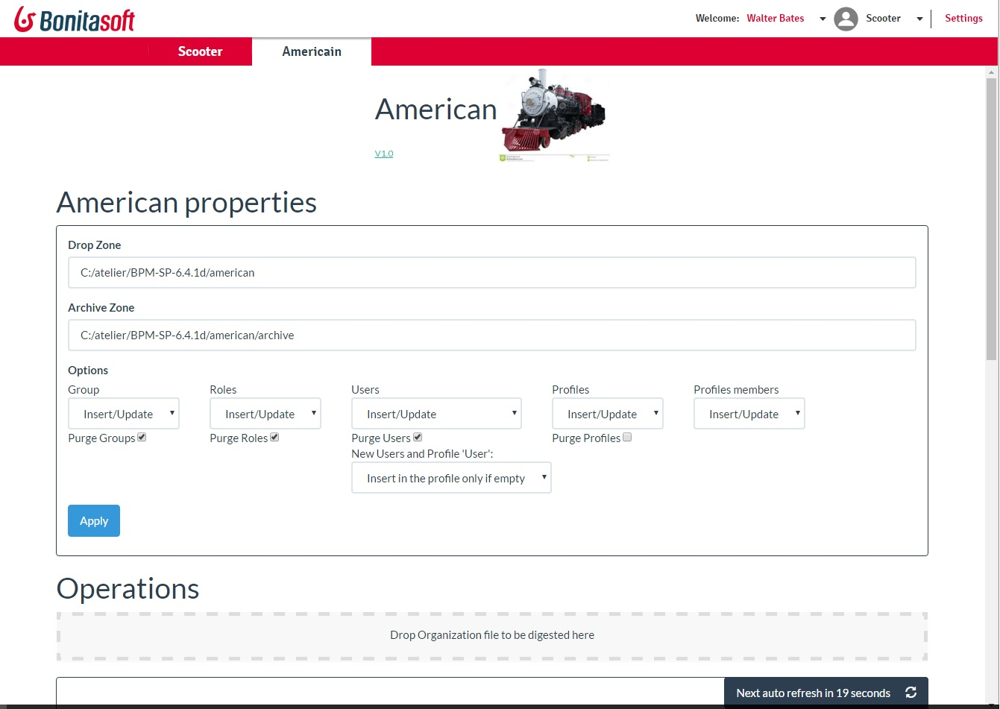

The Americain custom page can upload any organization, from a CSV source file.
It can run 
* to load a file at one moment, 
* to monitor a directory and load any file in this directory
* to run as a service

